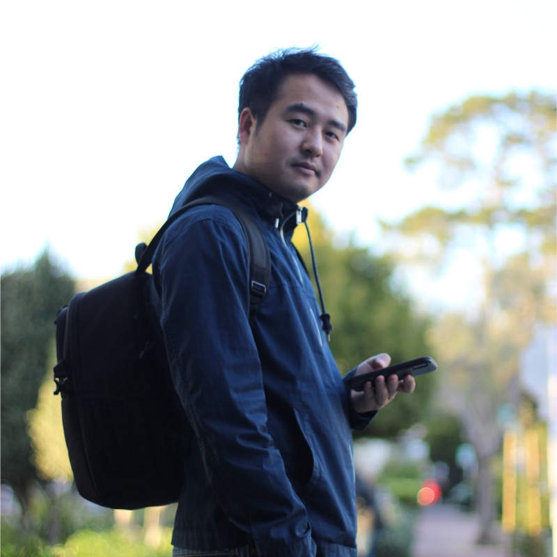

Greetings, I'm Kuan, a machine learning engineer with a scientific research background in physics. 
My passion lies in exploring the synergy between science and technology, particularly the exciting field of 
artificial intelligence. I reside in the Bay Area with my lovely wife and feline friend, and in my free time, 
I indulge in photography as a hobby. Sharing my knowledge and experiences through writing is a joy of mine, 
and I'm eager to keep learning and evolving within the realm of AI. 

 

